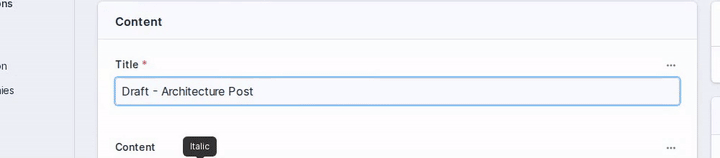
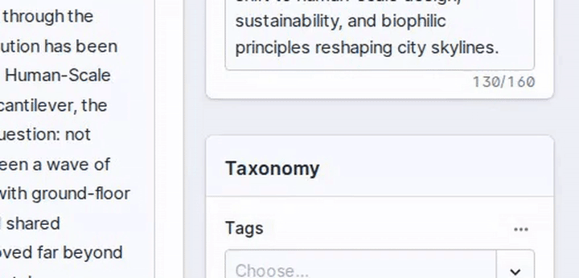
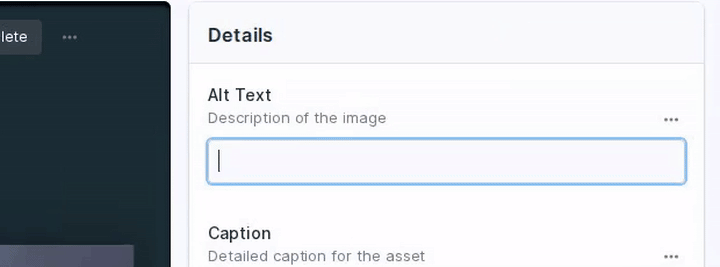

AI-powered field actions for Statamic. Generate alt text, extract tags, create teasers, transcribe audio, and more — directly from the control panel.

## Features

- **Zero-friction workflow**: One-click AI actions integrated directly into field UI
- **Multiple AI providers**: OpenAI, Anthropic, Gemini, and Mistral via [Prism PHP](https://prismphp.dev/)
- **Background processing**: Jobs run asynchronously with status tracking
- **Bulk actions**: Run actions on multiple entries/assets from listing views
- **CLI command**: `php please magic:run` for batch processing with dry-run support
- **9 built-in actions**: Alt text, captions, titles, meta descriptions, teasers, tags, transcription
- **Extensible**: Create custom actions — just extend `BaseMagicAction`

## Installation

```bash
composer require el-schneider/statamic-magic-actions
```

## Configuration

Add your API keys to `.env`:

```env
OPENAI_API_KEY=sk-...
ANTHROPIC_API_KEY=sk-ant-...
GEMINI_API_KEY=...
MISTRAL_API_KEY=...
```

Only add keys for the providers you plan to use.

Optionally publish the config:

```bash
php artisan vendor:publish --tag=statamic-magic-actions-config
```

## Built-in Actions

### Propose Title

Generate SEO-friendly titles from entry content.



### Extract Meta Description

Generate SEO-optimized descriptions (max 160 characters) from entry content.


### Extract Tags

Auto-generate taxonomy tags from entry content.



### Alt Text

Create accessible image descriptions using vision models.



### Action Reference

| Action                       | Description                              | Fieldtypes           | Source                   | Model  |
| :--------------------------- | :--------------------------------------- | :------------------- | :----------------------- | :----- |
| **Propose Title**            | SEO-friendly titles from content         | Text                 | Entry content            | Text   |
| **Extract Meta Description** | SEO descriptions (max 160 chars)         | Textarea             | Entry content            | Text   |
| **Extract Tags**             | Auto-generate taxonomy tags              | Terms                | Entry content            | Text   |
| **Alt Text**                 | Accessible image descriptions            | Text                 | Asset image              | Vision |
| **Image Caption**            | Narrative captions for images            | Text, Textarea, Bard | Asset image              | Vision |
| **Create Teaser**            | Preview text (~300 chars) from content   | Textarea, Bard       | Entry content            | Text   |
| **Transcribe Audio**         | Audio-to-text via Whisper                | Textarea, Bard       | Audio asset              | Audio  |
| **Assign Tags**              | Match content to existing taxonomy terms | Terms                | Entry content + taxonomy | Text   |
| **Extract Asset Tags**       | Generate tags from image analysis        | Terms                | Asset image              | Vision |

## Usage

### 1. Configure a field in your blueprint

In the Statamic control panel, edit any supported fieldtype and enable Magic Actions:

- **Enabled**: Toggle on
- **Action**: Choose from available actions (supports multiple per field)
- **Source**: Field containing source content
- **Mode**: Append or Replace

### 2. Click the magic button

A wand icon appears on configured fields. Click it to run the action.

### 3. Bulk actions

Select entries or assets in listing views — bulk action buttons appear automatically for all actions that declare `supportsBulk()`.

### 4. CLI batch processing

```bash
# Process all entries in a collection
php please magic:run --collection=pages --field=title --action=propose-title

# Dry run to preview targets
php please magic:run --collection=pages --field=title --action=propose-title --dry-run

# Process a specific entry by ID
php please magic:run --entry=entry-id --field=title --action=propose-title

# Queue jobs instead of running synchronously
php please magic:run --collection=pages --field=title --action=propose-title --queue
```

### 5. Queue processing

For best performance, configure a queue worker:

```bash
php artisan queue:work
```

> Without a queue worker, jobs run synchronously which may cause timeouts for longer operations.

## Custom Actions

Create your own magic actions by extending `BaseMagicAction`:

```php
<?php

namespace App\MagicActions;

use ElSchneider\StatamicMagicActions\MagicActions\BaseMagicAction;
use Prism\Prism\Schema\ObjectSchema;
use Prism\Prism\Schema\StringSchema;

final class Summarize extends BaseMagicAction
{
    public const string TITLE = 'Summarize';

    public function type(): string
    {
        return 'text';
    }

    public function schema(): ?ObjectSchema
    {
        return new ObjectSchema(
            name: 'summary_response',
            description: 'Content summary',
            properties: [
                new StringSchema('summary', 'Brief summary'),
            ],
            requiredFields: ['summary']
        );
    }

    public function rules(): array
    {
        return ['text' => 'required|string'];
    }

    public function system(): string
    {
        return 'You are a summarization expert. Create concise summaries.';
    }

    public function prompt(): string
    {
        return <<<'BLADE'
{{ $text }}
BLADE;
    }

    // Optional: enable bulk action support
    public function supportsBulk(): bool
    {
        return true;
    }

    public function bulkTargetType(): string
    {
        return 'entry';
    }
}
```

Register in the config:

```php
// config/statamic/magic-actions.php
'fieldtypes' => [
    'Statamic\Fieldtypes\Textarea' => [
        'actions' => [
            \App\MagicActions\Summarize::class,
        ],
    ],
],
```

## Action Types

| Type     | Use Case                | Model Examples                                                             |
| :------- | :---------------------- | :------------------------------------------------------------------------- |
| `text`   | Text-to-text processing | `gpt-4.1`, `claude-sonnet-4-5`, `gemini-2.0-flash`, `mistral-large-latest` |
| `vision` | Image analysis          | `gpt-4.1`, `claude-sonnet-4-5`, `gemini-2.0-flash`                         |
| `audio`  | Transcription           | `whisper-1`, `voxtral-mini-latest`                                         |

## Prompts with Blade

Prompts support Blade syntax with variables:

```php
public function prompt(): string
{
    return <<<'BLADE'
Content: {{ $text }}

Available Tags: {{ $available_tags }}
BLADE;
}
```

## Language Support

Most text actions auto-detect and match the input language. The system prompts instruct the AI to respond in the same language as the source content.

## Requirements

- PHP 8.2+
- Statamic 5.0+
- At least one supported provider API key (OpenAI, Anthropic, Gemini, or Mistral)
- Queue worker recommended

## License

MIT
